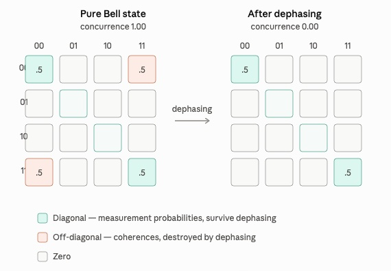

# Bell state density matrix explorer

An interactive visualisation of the two-qubit density matrix for Bell states,
with controls for dephasing, amplitude balance, and local single-qubit rotation.

Two qubits go through a Hadamard and a CNOT, producing one of the four Bell states 
depending on the input bits. The 4×4 density matrix is rendered as a greyscale grid 
where diagonal entries are measurement probabilities and off-diagonal entries are 
coherences. Sliders control dephasing, amplitude balance (θ), and single-qubit 
rotations on each qubit, with concurrence and purity displayed as live readouts. 

The tool deliberately steps one gate beyond Bell states to demonstrate a core
result in quantum information: **maximally entangled states are completely
immune to local operations at the single-qubit level.** Everything in the
interface is designed to make that result visible and interactive.

Below is an illustration of the concept, including color:



Experts might notice that this explorer only works with the real number parts 
for simplicity, so hues indicating variations in phase have been omitted. 

## Running locally

```bash
npm run serve
```

Then open <http://localhost:8000>. Any static server works; the ES module
imports mean opening `index.html` directly from the filesystem will not.

## Tests

```bash
npm test
```

Twelve tests covering the physics in `src/state.js`: trace preservation,
symmetry, the effect of dephasing on populations versus coherences, and the
bijection between input bits and Bell states.

## Deploying to GitHub Pages

1. Push to a GitHub repository with `main` as the default branch.
2. In the repository, go to Settings → Pages.
3. Under "Build and deployment", set Source to **GitHub Actions**.
4. Push to `main`. The workflow in `.github/workflows/deploy.yml` runs the
   tests, then publishes the repository root.

The site appears at `https://<user>.github.io/<repo>/`. Because every path in
`index.html` is relative, it works from a subdirectory without configuration.

## Circuit diagram

The circuit diagram panel shows the two-gate sequence that produces each Bell
state from a pair of classical input bits.

```
q0: |q0⟩ ──[H]──●──
                 |    ──  |Bell state⟩
q1: |q1⟩ ───────⊕──
```

**Hadamard gate (H)** is applied to q0. It takes a basis state and places it
into an equal superposition:

```
|0⟩  →  (|0⟩ + |1⟩) / √2
|1⟩  →  (|0⟩ − |1⟩) / √2
```

After H, q0 is genuinely in both states simultaneously — not a classical
coin flip but a coherent superposition that can interfere. The minus sign in
the second line is what produces the phase difference between Φ⁺/Φ⁻ and Ψ⁺/Ψ⁻.

**CNOT gate** uses q0 as the control (●) and q1 as the target (⊕). It flips
q1 if and only if q0 is \|1⟩. When the control is already in superposition,
this conditional flip correlates the two qubits in a way that cannot be
described by any product state — that correlation is entanglement.

The input ket labels update as you toggle the input buttons, and the output
label updates to the corresponding Bell state. The circuit itself never
changes; only the input changes.

**Local rotation Rᵧ(α)** appears after the CNOT, controlled by the Local
rotation slider:

```
q0: |q0⟩ ──[H]──●──[Rᵧ(α)]──
                 |               ── (locally rotated state)
q1: |q1⟩ ───────⊕─────────────
```

This gate is not part of the Bell state preparation — it sits outside the
bracket that produces the Bell state and is labelled separately in the diagram
so the boundary is always visible. The states it produces are no longer Bell
states; they are *locally equivalent* to Bell states, which is a distinct
class. The reason for including this gate is not to make new states but to
probe the Bell state: to ask what an observer holding only q0 can learn by
acting on it.

**Why Rᵧ and not Rx or Rz?** Bell states have real-valued amplitudes, and Rᵧ
has a real matrix — all entries are sines and cosines with no imaginary
components. Applying Rᵧ therefore keeps the density matrix real throughout,
which is why the Bloch vector y-component is always zero in this tool: it
equals `Tr(ρ σᵧ)`, which involves imaginary off-diagonal entries that are
never present in a real matrix. Rᵧ also sweeps Bloch vectors through the
x-z plane, which is exactly where they can move from their starting position
on the z-axis — making the effect visible. Rx would introduce complex-valued
density matrix entries and pull vectors into the y-direction, requiring the
imaginary part of the matrix to be tracked and rendered. Rz keeps z-axis
vectors on the z-axis (it adds a phase but no visible displacement), so it
would not illustrate the local-operation effect that motivates the control.

## How to read the matrix

Rows and columns are ordered 00, 01, 10, 11 in both directions.

Fill darkness encodes magnitude. A knocked-out horizontal bar marks a negative
entry. Blank cells are exactly zero.

Diagonal entries are the probabilities of each measurement outcome in the
computational basis. Off-diagonal entries are coherences: the phase relationship
between the two branches of the superposition. A classical mixture has the same
diagonal but no off-diagonal terms, which is why dephasing leaves measurement
statistics unchanged while destroying entanglement.

## Controls

The four toggles sit on two underlying bits, so `q0` and `phase` are the same
switch, as are `q1` and `Φ/Ψ family`. This mirrors the H + CNOT circuit: the
control qubit's input bit sets the relative phase, the target qubit's sets
whether the outcomes are correlated or anticorrelated.

| Input | Output |
| --- | --- |
| \|00⟩ | \|Φ⁺⟩ |
| \|01⟩ | \|Ψ⁺⟩ |
| \|10⟩ | \|Φ⁻⟩ |
| \|11⟩ | \|Ψ⁻⟩ |

**Dephasing** damps the off-diagonal terms by a factor of `1 - p` and leaves the
diagonal alone. At `p = 1` the state is a classical correlated mixture.

**Balance θ** sets the state to `cos θ |aa⟩ + sin θ |bb⟩`. At 45° the amplitudes
are equal and the state is maximally entangled. At 0° or 90° it collapses to a
product state — still pure, but with nothing to entangle.

**Rotate q0 α** applies Rᵧ(α) to q0 after the Bell state is generated.
Rᵧ(α) is a rotation of q0's Bloch vector in the x-z plane by angle α. At
α = 0 the state is an unmodified Bell state. At α ≠ 0 the state is no longer
a Bell state, though it remains locally equivalent to one. Watch the Bloch
sphere for q0 while turning this slider — what happens depends entirely on
Balance θ, and the contrast between θ = 45° and any other value is the point
of the control.

**Rotate q1 β** applies an independent Rᵧ(β) to q1 after the Bell state is
generated. It behaves symmetrically to the q0 rotation: at θ = 45° the Bloch
vector for q1 is pinned at the origin regardless of β, while at other values
of θ the vector responds and traces the x-z plane. Running both sliders
simultaneously demonstrates that no combination of single-qubit operations
can move either Bloch vector when the state is maximally entangled.

## Bloch spheres

A Bloch sphere represents the state of a single qubit as a point in or on a
unit sphere. Pure states sit on the surface; mixed states sit inside; the
maximally mixed state — equal probability of 0 and 1, no phase information —
sits at the centre.

The poles have a direct physical meaning:

| Position | State |
| --- | --- |
| North pole | \|0⟩ with certainty |
| South pole | \|1⟩ with certainty |
| Equator | equal superposition, phase varies around the equator |
| Centre | maximally mixed — no information survives |

The two panels show q0 and q1 individually. Because the full state is a
two-qubit state, each panel shows the **reduced density matrix** — the result
of tracing out (averaging over) the other qubit. This is the quantum analogue
of looking at one variable in a joint probability distribution while ignoring
the other.

**How the controls move the vectors**

*Balance θ* is the most direct control. The Bloch vector length is
`|cos 2θ|`, so it reaches the pole at θ = 0° or 90° and collapses to the
centre at θ = 45°. That collapse is the most important thing the spheres show:
at maximum entanglement the global two-qubit state is perfectly pure, yet each
individual qubit is completely random. All the information lives in the
correlations between the qubits, not in either qubit alone. Entanglement made
visible.

*Φ / Ψ family toggle* (q1 button) controls whether the two qubits are
correlated (both 00 or both 11 in the Φ family) or anti-correlated (01 or 10
in the Ψ family). Switching families flips q1's Bloch vector to the opposite
pole while leaving q0 unchanged.

*Phase toggle* (q0 button or phase button) sets the relative sign between the
two superposition branches. It does not appear in either Bloch sphere at all —
the partial trace that produces the individual qubit state washes out any
global phase. Phase is a two-qubit property, invisible to either qubit alone.

*Dephasing* also leaves the Bloch vectors stationary. Dephasing damps the
off-diagonal terms of the two-qubit density matrix, but the individual qubit
populations (the diagonal terms) are untouched, and it is the populations
alone that determine the Bloch vector under partial trace. You can watch
entanglement decay in the density matrix — the off-diagonal cells fading —
while the Bloch spheres show nothing happening. That contrast is the
difference between coherence (a property of the joint state) and the marginal
state of each qubit.

**Local rotation and the immunity of entanglement**

The local rotation slider is the sharpest demonstration in the tool. Set
Balance θ to 45° and move Local rotation α through its full range. The
two-qubit density matrix changes — the off-diagonal entries rotate in the
complex plane — but the Bloch spheres do not move. The vectors stay fixed at
the origin.

This is not a coincidence of the particular gate chosen. **Maximally entangled
states are completely immune to local operations at the single-qubit level.**
No gate applied to q0 alone — no rotation, no measurement, no transformation
of any kind — can change what an observer of q0 sees. The reduced density
matrix of q0 is the maximally mixed state I/2 regardless of what is done
locally, because all information about the joint state is stored in the
correlations between the two qubits, not in either qubit alone.

Now reduce θ below 45°. The immunity breaks. The Bloch vector for q0 begins
to respond to the rotation, sweeping through the x-z plane. The further θ
moves from 45°, the longer the vector and the more visibly it rotates. At
θ = 0° the state is a product state with no entanglement and the vector
traces a full circle as α varies.

The x and y components that appear under local rotation represent the
off-diagonal entries of q0's reduced density matrix — the single-qubit
coherence. For pure Bell states these are always zero because the superposition
in the two-qubit state is between terms that differ in both qubits
simultaneously; partial trace washes those cross terms out. The Bloch vectors
are confined to the z-axis until local rotation breaks the symmetry, and only
because the state is no longer maximally entangled.

**Connecting Bloch spheres to the matrix**

The density matrix diagonal gives the probability of each two-qubit outcome:
p(00), p(01), p(10), p(11). The Bloch vector z-component for q0 is
`p(0●) − p(1●)`, the difference between the probability of measuring q0 as 0
versus 1 regardless of q1. At θ = 45° those probabilities are equal, the
difference is zero, and the vector vanishes. At θ = 0° all weight is on \|00⟩
or \|01⟩, so p(0●) = 1, and the q0 vector reaches the north pole. The spheres
are a geometric summary of information already present in the diagonal of the
density matrix.

## Readouts

**Concurrence** measures entanglement from 0 (separable) to 1 (maximal). For
this family of states it is exactly twice the magnitude of the coherence.

**Purity** is `Tr(ρ²)`, which is 1 for a pure state and 0.5 for the fully
dephased mixture here. The two quantities are independent: an imbalanced pure
state has purity 1 and concurrence below 1.

## Structure

```
index.html              markup and controls
src/state.js            density matrix, concurrence, purity, partial trace, local rotation — no DOM
src/matrix-grid.js      density matrix SVG rendering
src/bloch-sphere.js     individual qubit Bloch sphere rendering
src/circuit-diagram.js  H + CNOT circuit diagram
src/app.js              control wiring
src/styles.css          light and dark themes
test/state.test.js      physics tests
```

`src/state.js` has no DOM dependency, so it can be imported in Node, tested, or
reused elsewhere.

## Extending

Some directions the current structure supports:

- Amplitude damping alongside dephasing (relaxation toward \|00⟩ rather than
  loss of coherence). This moves the diagonal, unlike dephasing, and would
  visibly displace the Bloch vectors toward the south pole.
- Complex phases in the density matrix. Adding Rx or Rz rotations, or
  starting from states with complex amplitudes, produces non-zero imaginary
  off-diagonal entries and a non-zero Bloch vector y-component. Rendering
  this would require a second grid for the imaginary part (or a hue channel
  in each cell) and removing the ry = 0 simplification from `blochVector()`.
- Measurement in a rotated basis, showing the interference that distinguishes a
  superposition from a mixture.

## License

MIT
